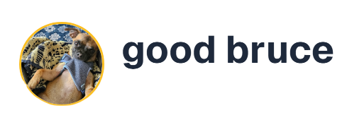

# Background Remover

A powerful background removal tool using deep learning (BiRefNet) with both a web UI (Gradio) and a production-ready API (FastAPI).

## Features

- Project logo: 
- Remove backgrounds from images using a state-of-the-art segmentation model
- Web interface for easy uploads and downloads
- REST API for programmatic access
- Example client script for automation

## Setup

1. **Clone the repository:**
   ```bash
   git clone git@github.com:valdezm/background-remover.git
   cd background-remover
   ```
2. **Install dependencies:**
   ```bash
   pip install -r requirements.txt
   ```
   (Or install individually: gradio, fastapi, uvicorn, torch, torchvision, transformers, pillow, requests)

## Usage

### Watermark

The project logo is added as a transparent watermark to the bottom-right of the output image.


### Web App (Gradio)

Run the Gradio interface:

```bash
python app.py
```

Open the local URL provided to interact with the web UI.

### API Server (FastAPI)

Run the FastAPI server:

```bash
uvicorn server:app --host 0.0.0.0 --port 8000
```

POST images to `/remove-background/` to receive processed images.

### Client Script

Process an image from the command line:

```bash
python client.py input.jpg output.png
```

## API Reference

- `POST /remove-background/` — Upload an image file, receive a PNG with background removed.

## Credits

- Model: [ZhengPeng7/BiRefNet](https://huggingface.co/ZhengPeng7/BiRefNet)
- Built with Gradio, FastAPI, PyTorch, HuggingFace Transformers

---

## HOW IT WORKS

### 1. Imports and Model Setup

- **Libraries:**
  - `gradio`: For building the web UI.
  - `load_img`: Custom function to load images.
  - `spaces`: For GPU annotation (for HuggingFace Spaces).
  - `transformers`, `torch`, `torchvision`: For deep learning and image processing.
- **Model Loading:**
  - Loads a segmentation model (BiRefNet) and moves it to the GPU.
- **Image Transform:**
  - Prepares images for the model (resize, normalize, convert to tensor).

### 2. Processing Functions

- **`fn(image)`**
  - Takes an uploaded image, loads and converts it to RGB.
  - Makes a copy of the original.
  - Calls `process(im)` to remove the background.
  - Returns both the processed and original images.
- **`process(image)`**
  - Prepares the image for the model.
  - Runs the model to get a segmentation mask.
  - Converts the mask to a PIL image, resizes it to match the input.
  - Applies the mask as an alpha channel (transparency) to the image.
  - Returns the image with the background removed.
- **`process_file(f)`**
  - For file uploads: loads the image, processes it, saves the result as PNG, and returns the new file path.

### 3. Gradio UI Components

- **Inputs/Outputs:**
  - `gr.ImageSlider`, `gr.Image`, `gr.Textbox`, `gr.File`: Different ways for users to upload images and view/download results.
- **Examples:**
  - Preloaded example images for quick testing.

### 4. Gradio Interfaces

- **Tabs:**
  - `tab1`: Upload an image and see the processed result.
  - `tab2`: Paste an image URL and see the processed result.
  - `tab3`: Upload a file and get a downloadable PNG with the background removed.
- **Tabbed Interface:**
  - Combines the above tabs into a single web app with multiple options for users.

### 5. How it Works for the User

1. User opens the web app (locally or on HuggingFace Spaces).
2. Chooses a tab (upload image, URL, or file).
3. Uploads or pastes an image.
4. App processes the image using the segmentation model.
5. User sees the result (image with transparent background).
6. User can download the processed image (PNG with transparency).

### 6. Summary

- The app is a web-based tool for removing backgrounds from images using a neural network.
- It’s interactive and user-friendly, thanks to Gradio.
- The heavy lifting (background removal) is handled by a pre-trained segmentation model running on GPU.

---

## Legacy

The following configuration is kept for compatibility with HuggingFace Spaces:

---

title: Background Removal
emoji: 🌘w🌖
colorFrom: purple
colorTo: indigo
sdk: gradio
sdk_version: 5.29.0
app_file: app.py
pinned: true
license: mit

---

Check out the configuration reference at https://huggingface.co/docs/hub/spaces-config-reference
